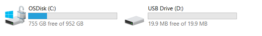

# Mass Storage Device Updates (MSD)

The MSD feature allows the device to be updated without the Segger tool, instead utilizing USB. Only the main application or their resources (coffee_machine/elevator) can be flashed in this manner. If the bootloader needs to be updated, the Segger tool or the Factory Programming flow is necessary.
The MSD feature, by default, bypasses signature verification to allow an easier development flow, seeing as signing images can be unsuitable for quick debugging and validation.

<!--  -->

## Enabling MSD Mode

To enable MSD mode on the SLN-TLHMI-IOT, simply press and hold the `SW0` button while powering on the board.
If done correctly, the board's onboard LED will change to purple and begin blinking at an interval of roughly 1 second.

```{note}

As mentioned in the Getting started guide, the `SW8` dip switch should be set as 0001, in order to properly use `SW0` as a general purpose switch.
```

Additionally, if connected to a Windows PC, your computer should make a sound indicating a new USB device has been connected.
After observing the LED blinking behaviour, navigate to “My Computer”, and confirm that the SLN-TLHMI-IOT kit has mounted as a Mass Storage Device as shown in the picture below.



The size of the new storage device is equal with the Bank Size of the device from which you subtract the file system metadata.
## Flashing a New Binary

The binary size increases exponentially when adding the GUI resources. Almost 70% of the total size is occupied by these sounds and images. In order to speed up the development and to decrease the load on the updating mechanism, the large images have been split into `code and resources`, both with fixed addresses in the flash.
Update operations can be done on individual components, or all together into something called a bundle.

Right now the MSD can be used to update :
* Main Application
* Resources
* Bundle update (Main Application + Resources)

### Main Application

To update the main application, a binary must be built for the address `0x30100000`.
Because of the remap functionality enabled in bootloader, this binary can be placed in each of the three banks, and still work as it is running from the base address. The bootloader checks for the current unused bank and tries to write the image in that specific bank.
When drag and dropping a binary for the main application, the bootloader checks if the reset handler of the new image is a flash address.
No other verification is done; the functionality correctness must be handled by the developer.
After the new image has been written to the empty bank, the UI resource are brought/copied from the older bank to the new bank.
This means that during the update procedure, the resources will stay the same.


```{image} ../../img/Update_MainApp.png
:align: center
```
As presented in the last figure, the operations are:
* write new application image in the free bank
* copy the resources from the current active bank
* make bank B the active bank in order for bootloader to jump to it.

### Resources

When updating the resources, the binary needs to be renamed into `RES.bin`.
The Bootloader contains a list of known files, res.bin being one of those file.
No verification is done on the resources binary.

In the same way as updating the main application, the bootloader checks for active bank and writes the binary in the unused one.
After the write is completed, the older firmware is copied and the new bank is activated.

```{image} ../../img/Update_Resources.png
:align: center
```

As presented in the last figure, the operations are:
* write new resources in the free bank
* copy the current active boot application in the new bank
* make the new bank (in the figure, bank B) the active bank in order for bootloader to jump to it.

### Bundle

In order to update with the bundle method, a python script is used to generate the bundle.
In order for the bootloader to parse and write all the modules to their designated addresses, metadata must be added to the package.
Two types of metadata exists:
* Bundle metadata - placed at the end of the bundle and contains:
    * Bundle size
    * Number of modules
    * Signature of the whole bundle
* Module metadata - placed after every module and contains:
    * Module type (Application or Resources)
    * Module starting address
    * Module length
    * Module signature

All this metadata information is being added by the script mentioned before.
The script is part of the ivaldi suite of scripts which is delivered to the customer.
The script is called "bundle_generate_tlhmi.py". When calling it, two parameters need to be set, both being the locations for two important files:
* bundle configuration file (-bf) - contains a list of files that are going to be fused to generate the bundle.
* board configuration file (-cf) - position of the files in flash in order to build the metadata.

In the released version of ivaldi, both bundle config and board config are placed under the platform config folder.
A full Linux bash command to call this script, issued from ./Scripts/ota_signing/sign looks like:

```bash
python bundle_generate_tlhmi.py -bf ../../../Scripts/sln_platforms_config/sln_tlhmi_iot_config/ -cf ../../../Scripts/sln_platforms_config/sln_tlhmi_iot_config/
```
```{image} ../../img/OTA_BundleGenerateScriptOutput.png
:align: center
```

After this, in the "Scripts\ota_signing\sign\output" folder, four files are present.

```{image} ../../img/Update_BundleGenerateScript.png
:align: center
```

 For MSD only `bundle.bin` is of interest, the other three relevant in the Over-The-Air updates, where validation is an important feature.
 To update with the `bundle.bin` just drag and drop the binary. The name must not be modified, as this names is part of a hardcoded list of known files.

```{image} ../../img/Update_Bundle.png
:align: center
```
As presented in the last figure, the operations are:
* write new bundle containing the application and resources in the free bank.
* parse the metadata and find the starting address of each component
* move the components to the corresponding flash address
* make the new bank (in the figure, bank B) the active bank in order for bootloader to jump to it.

<!--  -->

Upon completion, the board will automatically reboot itself into the new firmware which was just flashed. This can be verified by opening the serial CLI and typing the `version` command again
and checking that the application is running from the alternate flash bank.
