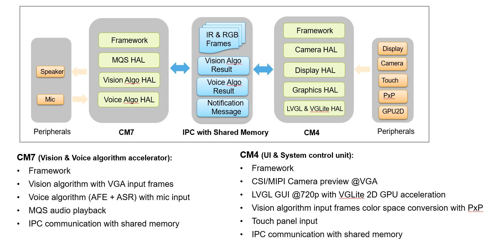
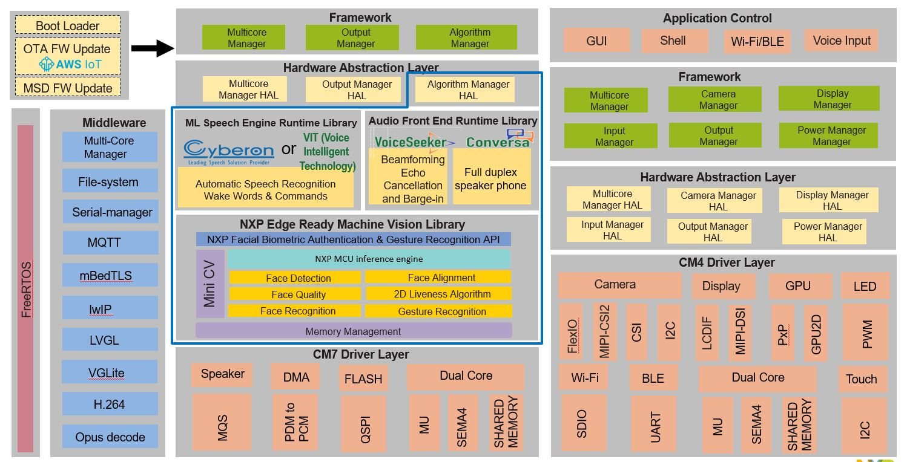

# Introduction

This Coffee Machine application demonstrates the Coffee machine use case with below core functionalities:
- Coffee machine GUI with touch support
- Local voice command to control the use cases of Coffee machine
- Face recognition to store user's coffee preference automatically

For leveraging the full computational power of the RT107H, the image has been split in two images that are running in parallel on the CM7 and CM4 cores.
The Coffee Machine CM7 will act as an AI block, handling all the machine learning operation, such as face recognition and voice command. The operation have been optimize in order to obtain the best performance on this type of MCU.
The Coffee Machine CM4 will hold the user interaction (display, shell, buttons). The CM4 image is being loaded into memory by the CM7 core.

By default, i.MX RT117H boot from CM7. By fusing BT_CORE_SEL (Bit 12 in 0x960), the chip switches to CM4 as main core. For more info on this topic check [Application Note 13264](https://www.nxp.com/docs/en/application-note/AN13264.pdf).

The Coffee Machine uses below HW components and peripherals:
- 2 x PDM MIC - configured to worked with 16kHz sampling. The conversion to PCM is done in hardware using the PDM microphone interface.
- 16KHz raw data to RT117x MQS HW peripheral that generates PWM data output.
- External filtering and coupling.
- Analog audio amplifier.
- MIPI GC2145 Camera - configured to work with 600x800 resolution.
- LCDIFV2 Rocktech RK055MHD091 - configured to work at HD resolution of 1280x720

In order to change this configuration check HAL code and "How to develop user app" section

It uses NXP's below core technologies:
- LVGL based GUI
- Local voice command algorithm
- Face recognition algorithm
- Dual core architecture based on multi-core manager (mcmgr) middleware component.

# Architecture

# Software Block Diagram

It includes two projects as below:

-Host CM7 project

-Slave CM4 project

Each project uses a two layer architecture containing a Framework + HAL" layer, and the "Application" layer. Please refer to the docs for each project for the details.
