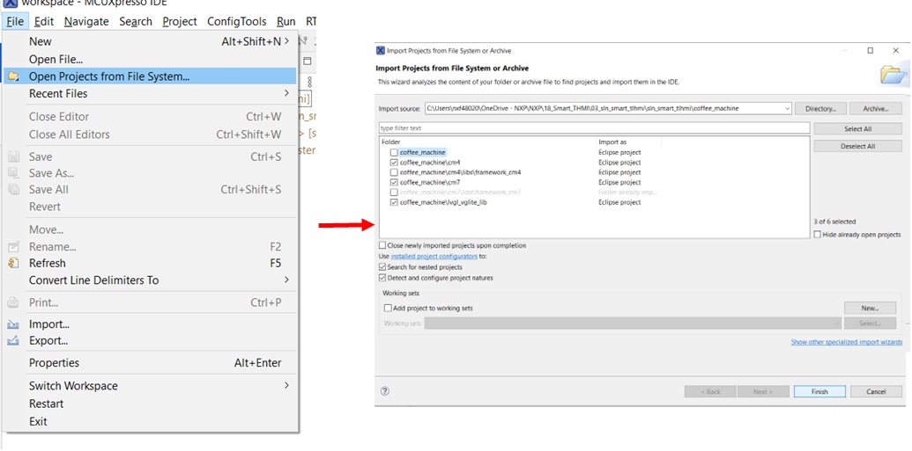

# Setup and Installation

This section is focused on the setup and installation of the tools necessary to begin developing applications using NXP's framework architecture.

```{note}
This guide will focus on the use of [MCUXpresso IDE](https://www.nxp.com/design/software/development-software/mcuxpresso-software-and-tools-/mcuxpresso-integrated-development-environment-ide) for development.
```
## MCUXpresso IDE

The MCUXpresso IDE brings developers an easy-to-use Eclipse-based development environment for NXP® MCUs based on Arm® Cortex®-M cores, including its general purpose crossover and Bluetooth™-enabled MCUs. The MCUXpresso IDE offers advanced editing, compiling, and debugging features with the addition of MCU-specific debugging views, code trace and profiling, multicore debugging, and integrated configuration tools. The MCUXpresso IDE debug connections support Freedom, Tower® system, LPCXpresso, i.MX RT-based EVKs, and your custom development boards with industry-leading open-source and commercial debug probes from NXP, P&E Micro®, and SEGGER®.

More information about the MCUXpresso IDE can be found at the [NXP website](https://www.nxp.com/design/software/development-software/mcuxpresso-software-and-tools-/mcuxpresso-integrated-development-environment-ide)

## Install the toolchain

The MCUXpresso IDE can be downloaded from the NXP website by using the below link:

[Get MCUXpresso IDE](https://www.nxp.com/webapp/swlicensing/sso/downloadSoftware.sp?catid=MCUXPRESSO)


You can check out the [Getting Started Guide]() to download the correct version of IDE, once the download has completed, simply follow the instructions in the installer to get started.

```{note}
There is currently a bug with version 11.5.1 of MCUXpresso IDE which prevents building projects for the SLN-TLHMI-IOT, so version 11.5.0 or version 11.6.0 or greater is required.
```


## Install the SDK

In order to build projects using the MCUXpresso IDE, you must first install an SDK for the platform you intend to use.
A compatible SDK has required dependencies and platform-specific drivers needed to compile projects.

A compatible SDK can be downloaded from the official [NXP SDK builder](https://mcuxpresso.nxp.com/en/select)

To build the SDK for your preferred setup, we can use  MCUXpresso IDE to install SDK. Upon opening the application, you will be greeted with the MCUXpresso IDE welcome screen as shown below, click **Download and Install SDKs**:


Here you will see a catalog of all the SDKs that can be downloaded through MCUXpresso. These SDKs provide device knowledge, drivers, middleware, and reference example applications for your development board or MCU. Type ***evkmimxrt1170*** in the filter section and download evkmimxrt1170 SDK.
The current applications were developed and tested on SDK 2.11.1.


A prompt will display the license agreement associated with the 1170 SDK. Read the license and then accept to automatically start the SDK installation. MCUXpresso will proceed to download the SDK.


## Import example projects

***important:***
You **must** have a compatible MCUXpresso SDK package for the SLN-TLHMI-IOT installed to build example projects you import regardless of how they are imported.

MCUXpresso IDE allows you to open example projects from source folder.

### Import from Github

***important:***
Before you begin, make sure you have [ Git ](https://git-scm.com/downloads) downloaded and installed on the machine you intend to use.

The latest software updates for the SLN-TLHMI-IOT application can be downloaded from our official [Github repository](https://github.com/NXP/sln_tlhmi_iot). Here, you will find the most up-to-date version of the code which will contain the newest features available for the Smart TLHMI project.

To import the SLN-TLHMI-IOT Smart TLHMI application into MCUXpresso IDE using Github,
perform the following steps:

1. Clone the **sln_tlhmi_iot** repository.
    * Cloning directly to your MCUXpresso workspace location is recommended, but not required.
2. In MCUXpresso, navigate to the **File** from Toolbar.
3. Click **Open Projects from File System...**.
4. Select **Directory...**.
5. Navigate to the file path of the project cloned in the first step and click **Select Folder**.
6. Check the box next to each project (bootloader, coffee_machine\cm4, coffee_machine\cm7, coffee_machine\lvgl_vglite_lib and elevator\cm4, elevator\cm7, elevator\lvgl_vglite_lib) you wish to import.
7. Click **Finish**



After following the above steps,
confirm that the projects can be found in the **Project Explorer** panel to ensure they were successfully imported.


