# Getting started with phoneme-based voice engine tool

NXP partners with Cyberon for generating phoneme-based voice engines. The voice engine supports speaker-independent recognition and there is no need to collect speech data for training specific commands in advance. With the generation tool, you can create your own custom voice engine by simply typing text.

The TLHMI solution supports Far-Field voice recognition enabled by phoneme-based Automatic Speech Recognition (ASR) engine, digital signal processing (DSP), and audio front end (AFE).
This chapter describes:
1. How to create or modify phoneme-based voice engine in various languages
2. How to integrate a generated voice engine into TLHMI solution software
3. Guide for voice recognition improvement
4. Technical specification information of the voice engine

# Installation

The generation tool requires you to log in. To get access to the tool, contact NXP (local-commands@nxp.com) with the following information.
1. Company name
2. User’s name
3. User’s e-mail address
4. Physical address (a.k.a MAC address) of PC’s network interface.

We will reach out to let you know when the account is created.
The installation package for Cyberon DSpotter Modeling Tool (DSMT) V2 can be found at this address: [DSpotter Modeling Tool](https://tool.cyberon.com.tw/DSMT_V2/index.php?lang=en)

The installation package contains the following items.
1. Cyberon DSpotter Modeling Tool (DSMT) V2
2. DSpotter Offline Test Tool V2
3. DSpotter Online Test Tool V2
You are required to install all of them.
While installing the modeling tool, you are prompted to install the offline / online test tools.

Please also install the Cyberon DSpotter GarbGen Tool from this address: [DSpotter GarbGen Tool](https://tool.cyberon.com.tw/DSpotterGarbGenTool/index.php?lang=en)

# Load the project template

***Note: This guide will focus on exemplifying how DSMT tool works by using the Coffee Machine demo template for English language.***

Firstly, please copy the coffee_machine/oob_demo_en.dsmt file in the MCUXpresso project at the location below.

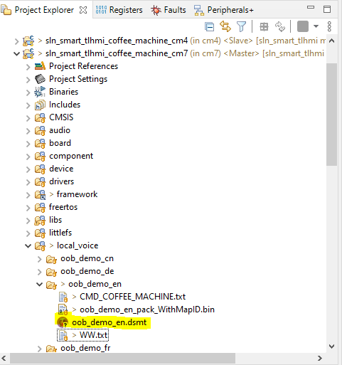

Ensure that the DSpotter Modeling Tool (DSMT) is installed.
To load the project template:
1. Launch the application.
2. A window prompts you to enter your credentials. Log in with your credentials.
3. Click File > Load Project

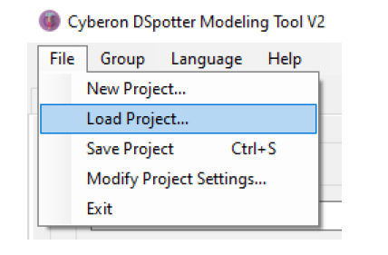

4. Open the DSMT project previously copied into the workspace.

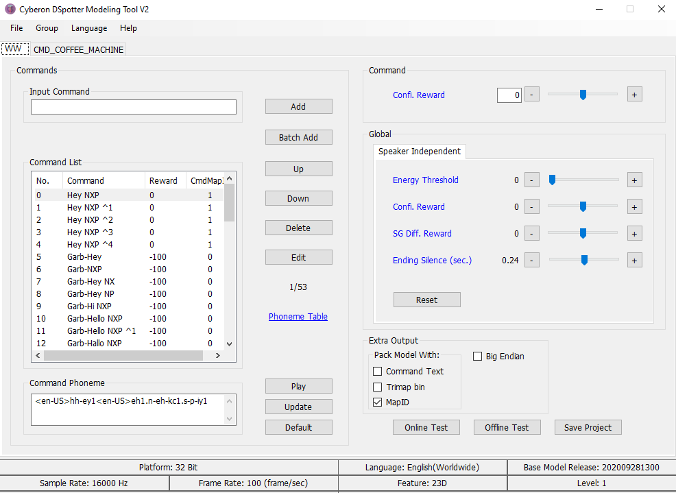

# Add a new command into the Coffee Machine demo

***Note: For an easier demonstration we will remove the garbage words here. Please delete all entries after "Deregister" command.***

To add a new command into the Coffee Machine demo:
1. Click CMD_COFFEE_MACHINE tab on the DSMT tool.
2. Type a new command, then press on "Add". For example, "Mochaccino". This command will be inserted at the end, as shown below (this is the reason for which we have deleted the garbage words, we would have needed to press the "Up" button for more than 300 times to bring the new command on the position from the image below.)
<!-- I don't understand the intent behind the words in the parenthetical -->

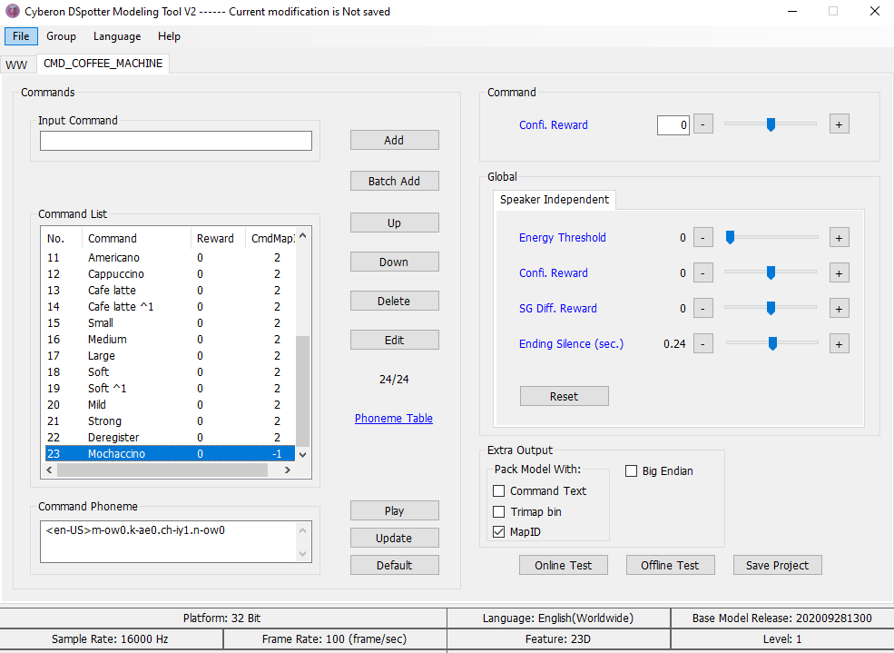

3. Edit the CmdMapId from -1 to the one used for the other commands of this command group, which is 2. In order to do that double click on the command.

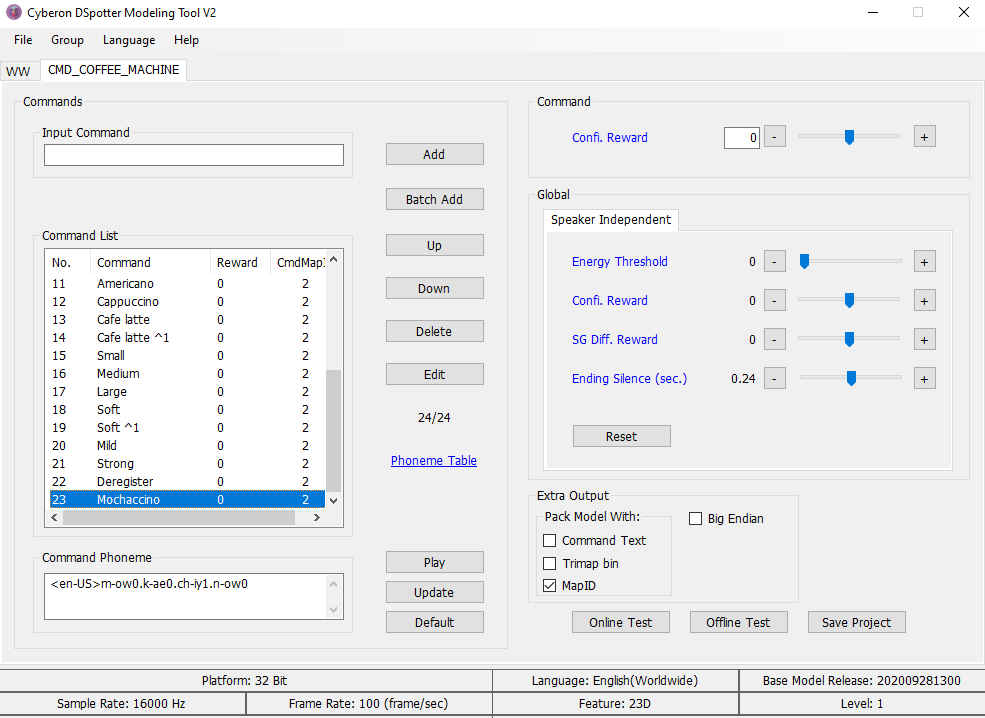

4. Save the project (either by Ctrl + S, either by pressing the "Save Project" button.)

## Integrate the voice engine in MCUXpresso project

If the DSMT template was copied into the folder mentioned above, the binary containing the speech model will be automatically updated when you save the DSMT project.

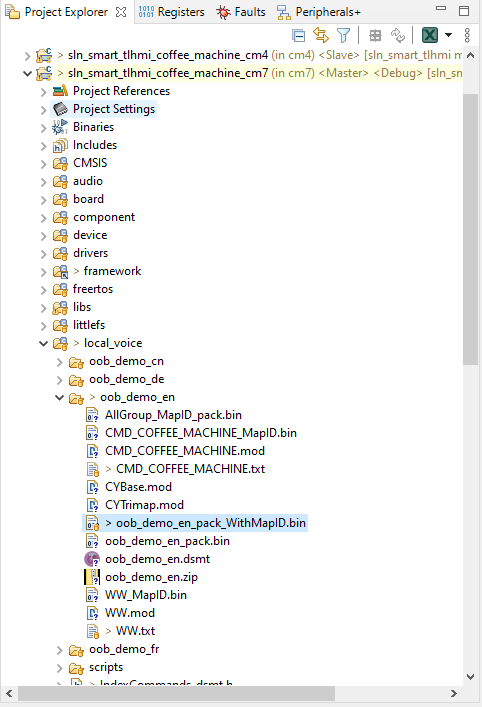

We now need to update a few things in the firmware to add support for the new command. For the sake of the example we will do the same action on the GUI for Mochaccino as we are doing for Cappuccino.

1. Update IndexCommands_dsmt.h. Increase the total number of commands by 1 and also add an action in action_coffee_machine_en, specifying that we will have the same action as for Cappuccino.

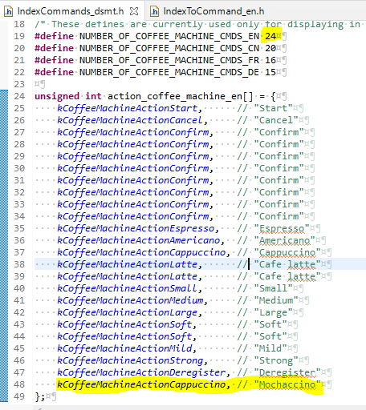

2. Update IndexToCommand_en.h. Add a string representation of the new command.

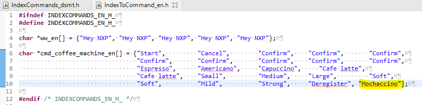

3. Build and flash the project. You should now be able to see the command "Mochaccino" being detected and also triggering the same action as the "Cappuccino" command.

# Add a new language into the Coffee Machine demo

1. Open DSMT and login

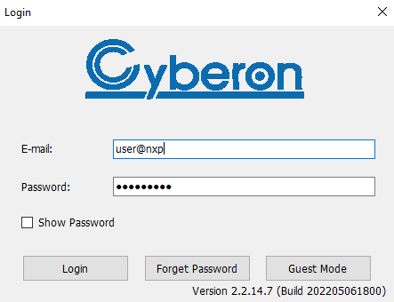

2. File -> New Project. Use name oob_demo_it, choose the Italian language. Press Ok.

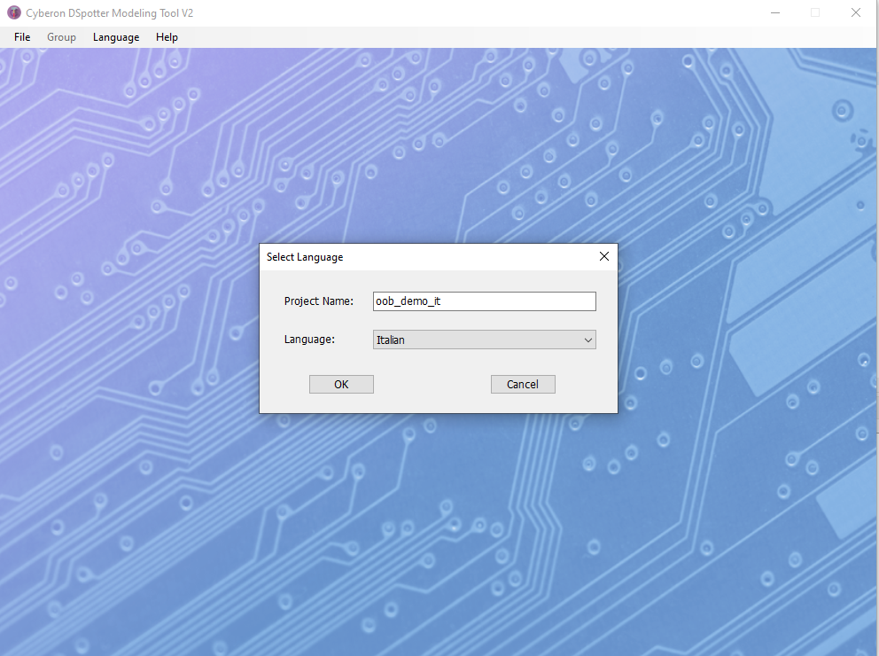

3. Use the default settings. Press ok.

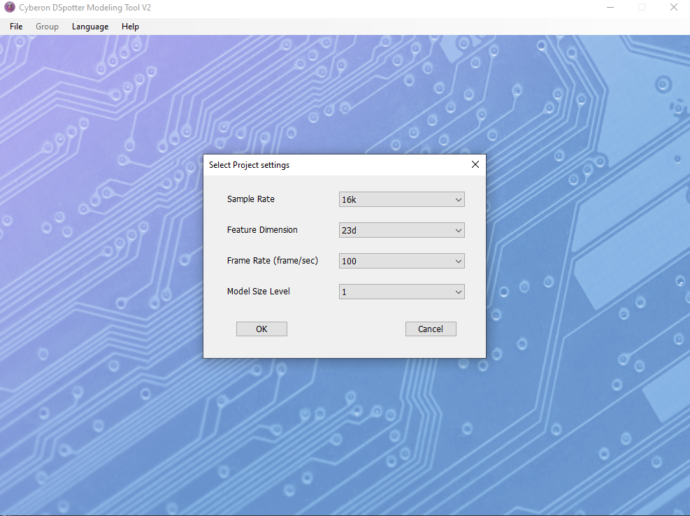

4. When asked about the Folder where the project should be saved, go to the workspace location of the cm7 Coffee Machine demo project -> local_voice folder.

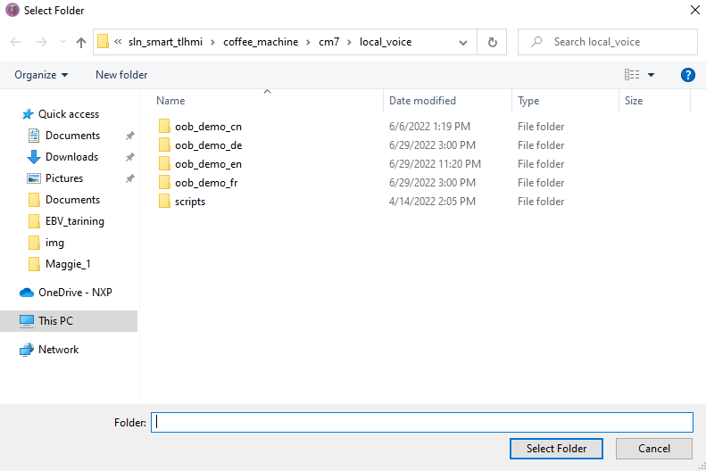

5. Rename Group_1 to WW by selecting Group -> Rename.

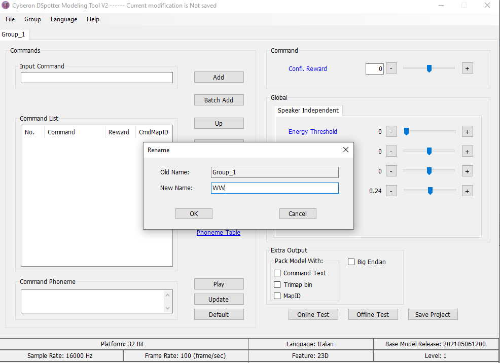

6. Add a simple wake word - let's use "Ciao NXP". By default CmdMapId will have value -1. Please change that to value 1 by double clicking on the wake word.

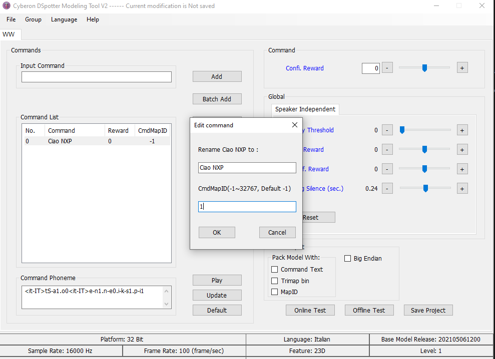

7. Add a new group by selecting Group -> Insert. Change the group name to CMD_COFFEE_MACHINE.

Add the commands below and change CmdMapId value to 2 for all of them.

Inizia, Annulla, Confermare, Caffè espresso, Caffè americano, Cappuccino, Caffè Latte, Piccolo, Medio, Grande, Leggero, Mite, Forte, Annullare la registrazione.

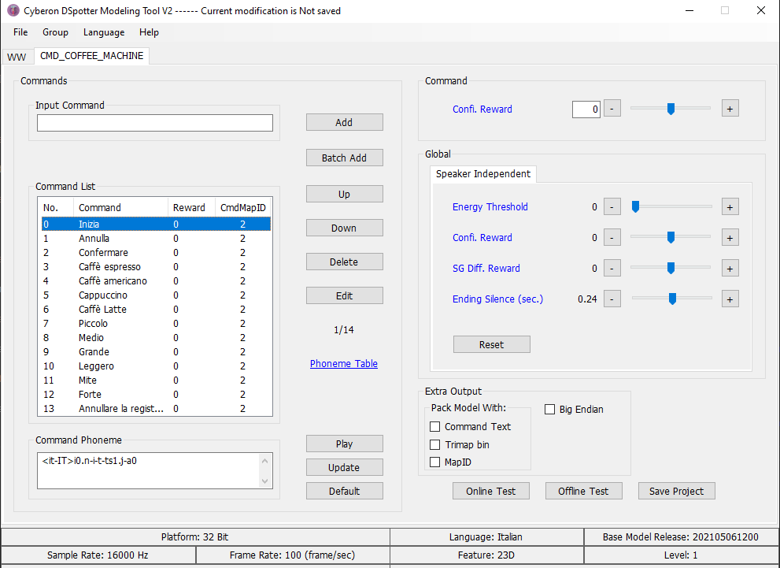

8. Very important: Check the MapID checkbox, otherwise the binary we need to integrate into our project will not be generated.

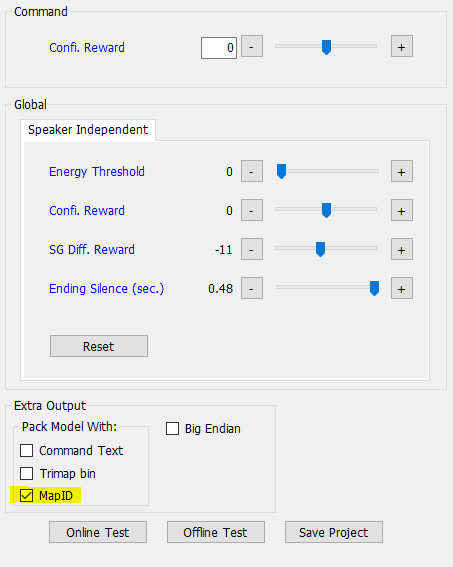

9. Save the DSMT project (Ctrl + S or File -> Save project).

10. Now we will modify the source code to use the newly generated Italian speech model. It will be easier to replace one of the existing models, like French.

- create IndexToCommand_it.h

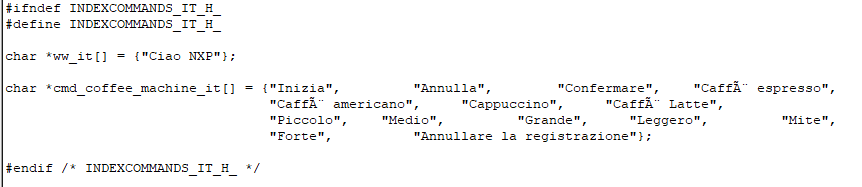

Replace the following symbols in your workspace:
- ASR_FRENCH with ASR_ITALIAN
- NUMBER_OF_COFFEE_MACHINE_CMDS_FR with NUMBER_OF_COFFEE_MACHINE_CMDS_IT (need to add that in IndexCommands_dsmt.h). NUMBER_OF_COFFEE_MACHINE_CMDS_IT should be 14.
- action_coffee_machine_fr with the equivalent action_coffee_machine_it
- action_coffee_machine_fr can be removed from IndexCommands_dsmt.h
- In IndexCommands_dsmt.h include "IndexToCommand_it.h" instead of "IndexToCommand_fr.h"
- action_coffee_machine_it shall be defined, as shown below

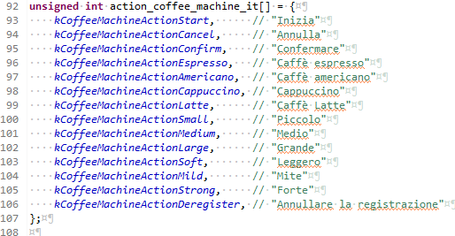

- replace oob_demo_fr_begin with oob_demo_it_begin everywhere in the workspace
- use oob_demo_it_pack_WithMapID.bin in local_voice_model.s

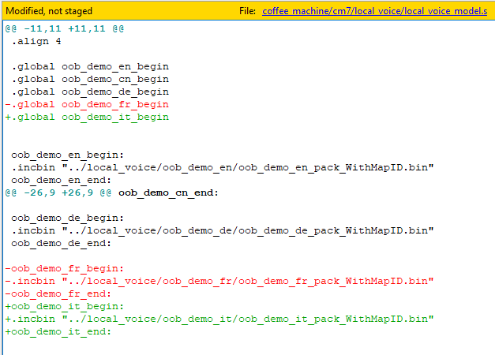

11. Replace s_memPoolWLangFr with s_memPoolWLangIt.
12. Delete the cm7 debug folder and rebuild afterwards. Flash the project. You should now be able to interact with the dev kit through voice.

# More details regarding Cyberon tools

Please check the video tutorials available here: [Cyberon demos](https://www.youtube.com/playlist?list=PLTEknqO5GAbrDX5NMs-P6b9THWwamgVBo)

